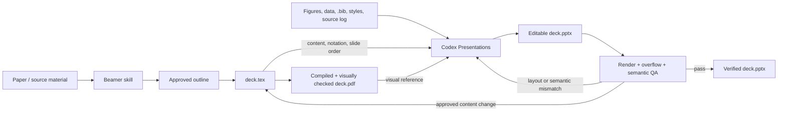

# Beamer Skill

An AI coding assistant skill for creating, compiling, reviewing, and polishing academic **Beamer LaTeX** presentations.

Supports **Claude Code**, **OpenAI Codex CLI**, **Google Antigravity**, and **VS Code** AI extensions (Copilot, Cline, Cursor).

Full lifecycle: **create → compile → review → polish → verify.**

Need an editable PowerPoint at the end? Use the optional **Beamer-first, PowerPoint-second** workflow below: establish the argument, technical depth, and visual structure in Beamer, then hand the verified `.tex` and `.pdf` to Codex Presentations for an editable `.pptx` rebuild.

## Features

| Action | Description |
|--------|-------------|
| `create [topic]` | Collaborative, iterative lecture creation with phase gates (material analysis → needs interview → structure plan → draft → quality loop) |
| `compile [file]` | 3-pass XeLaTeX + bibtex with post-compile diagnostics |
| `review [file]` | Read-only proofreading report (grammar, typos, overflow, consistency, academic quality) |
| `audit [file]` | Visual layout audit (overflow, fonts, boxes, spacing) |
| `pedagogy [file]` | Holistic pedagogical review with 13 validation patterns |
| `tikz [file]` | TikZ diagram review and SVG extraction |
| `excellence [file]` | Comprehensive multi-dimensional quality review |
| `devils-advocate [file]` | Challenge slide design with pedagogical questions |
| `visual-check [file]` | PDF-based visual verification of compiled slides |
| `validate [file]` | Structural validation against skill constraints |
| `extract-figures [pdf]` | Extract figures from paper PDFs for direct inclusion in slides |

### Highlights

- **Quality scoring system** — automated rubric (start at 100, deduct per issue) with Excellent/Good/Needs Work/Poor thresholds
- **No overlays** — no `\pause`, `\onslide`, `\only`. Uses multiple slides and color emphasis instead
- **Content density guards** — upper bounds (7 bullets, 2 equations, 5 symbols per slide) and lower bounds (every slide earns its place)
- **Box overflow detection** — Beamer suppresses overflow warnings inside blocks; the skill catches them via visual audit
- **Motivation before formalism** — every concept starts with "Why?" before "What?"
- **TikZ precision** — mathematical accuracy enforced via `\pgfmathsetmacro` (no hardcoded approximations)
- **Semantic color system** — colorblind-safe palette (`\pos{}`, `\con{}`, `\HL{}`) with WCAG AA contrast (≥ 4.5:1)
- **Figure extraction** — pull figures directly from paper PDFs via `pdf-mcp`, ready for `\includegraphics`
- **Markdown paper input** — use `.md` as a clean intermediate when PDF parsing loses structure; keep the PDF available for figures
- **Timing allocation** — built-in slide-count heuristics for 5min lightning talks through 90min lectures
- **Columns & layout rules** — enforced `columns[T]` patterns with gap/width constraints
- **Backup slides** — automatic appendix section for anticipated Q&A
- **Algorithm & code support** — `algorithm2e`, `listings`, `pgfplots` integration with per-slide line limits
- **XeLaTeX only** — modern font handling, 16:9 aspect ratio, 10pt default
- **Editable PPTX hand-off** — a documented workflow for rebuilding a verified Beamer deck with Codex Presentations without asking this skill to become a PowerPoint generator

## Prerequisites

### TeX Distribution

A full TeX distribution with XeLaTeX is required:

```bash
# macOS
brew install --cask mactex

# Ubuntu/Debian
sudo apt install texlive-full

# Arch
sudo pacman -S texlive
```

### pdf-mcp (Recommended)

Install [pdf-mcp](https://github.com/Noi1r/pdf-mcp) (fork with file-based image extraction — avoids base64 token bloat) so Claude Code can read large PDFs (papers, references) and extract figures directly:

```bash
pip install git+https://github.com/Noi1r/pdf-mcp.git
claude mcp add pdf-mcp --scope user pdf-mcp
```

If you use a SOCKS proxy, also install `socksio` (required by `httpx` for SOCKS support):

```bash
pip install socksio
```

This enables the `create` action to analyze research papers and `extract-figures` to pull figures for slide inclusion.

## Installation

Clone the repo first:

```bash
git clone https://github.com/Noi1r/beamer-skill.git
```

### Claude Code

Copy the skill directory into your Claude Code skills folder:

```bash
mkdir -p ~/.claude/skills
cp -r beamer-skill/beamer ~/.claude/skills/
```

Restart Claude Code. The skill will be automatically detected and triggered when you mention beamer, slides, lecture, tikz, or related keywords.

### OpenAI Codex CLI

Copy `AGENTS.md` and `references/` into your project root:

```bash
cp beamer-skill/beamer/AGENTS.md your-project/AGENTS.md
cp -r beamer-skill/beamer/references your-project/references
```

Codex CLI automatically reads `AGENTS.md` from the working directory. The main file contains core rules and action summaries; detailed workflows are in `references/` and referenced as needed.

### Google Antigravity

Antigravity is compatible with the `SKILL.md` format. Copy the skill directory:

```bash
mkdir -p ~/.claude/skills
cp -r beamer-skill/beamer ~/.claude/skills/
```

The same `SKILL.md` used by Claude Code works with Antigravity without modification.

### VS Code — GitHub Copilot

Copy the Copilot instructions file into your project:

```bash
mkdir -p your-project/.github
cp beamer-skill/.github/copilot-instructions.md your-project/.github/
```

Copilot Chat automatically reads `.github/copilot-instructions.md` and applies the rules during conversations.

### VS Code — Cline

Copy the Cline rules file into your project:

```bash
mkdir -p your-project/.clinerules
cp beamer-skill/.clinerules/beamer.md your-project/.clinerules/
```

Cline automatically loads all files in `.clinerules/` as custom instructions.

### VS Code — Cursor

Copy the Cursor rules file into your project:

```bash
mkdir -p your-project/.cursor/rules
cp beamer-skill/.cursor/rules/beamer.mdc your-project/.cursor/rules/
```

Cursor automatically loads `.mdc` files from `.cursor/rules/`. The `globs` field in the frontmatter ensures the rules activate for `.tex`, `.bib`, and `.sty` files.

## Platform Comparison

| Platform | Instruction file | Content level | Auto-trigger |
|----------|-----------------|---------------|-------------|
| Claude Code | `SKILL.md` | Full (~55KB) | Yes (keyword matching) |
| Antigravity | `SKILL.md` | Full (~55KB) | Yes (keyword matching) |
| Codex CLI | `AGENTS.md` + `references/` | Medium (~30KB total) | Yes (auto-reads AGENTS.md) |
| VS Code Copilot | `.github/copilot-instructions.md` | Compact (~5KB) | Yes (auto-reads) |
| VS Code Cline | `.clinerules/beamer.md` | Compact (~5KB) | Yes (auto-reads) |
| VS Code Cursor | `.cursor/rules/beamer.mdc` | Compact (~5KB) | Yes (glob-triggered on .tex) |

## Usage

Once installed, the skill is triggered automatically when you mention beamer, slides, lecture, tikz, or related keywords.

**Create a lecture from a paper:**
```
Help me create a beamer presentation based on this paper: /path/to/paper.pdf
```

**Create from converted Markdown (recommended when PDF parsing is weak):**
```
Help me create a beamer presentation based on this paper markdown: /path/to/paper.md
```

Markdown often preserves section hierarchy, equations, captions, and references better than direct PDF reading. If PDF parsing loses structure, first convert the paper to Markdown with MinerU or another PDF-to-Markdown tool, then pass the `.md` file to `create`. This is optional; MinerU is not a required dependency. Keep the original PDF available when you need figure extraction or page-level visual reference.

**Extract figures from a paper:**
```
Extract figures from /path/to/paper.pdf for my slides
```

**Compile slides:**
```
Compile my slides: /path/to/slides.tex
```

**Full quality check:**
```
Run excellence review on /path/to/slides.tex
```

**Proofread only:**
```
Proofread /path/to/slides.tex
```

## Recommended Workflow: Beamer First, Editable PowerPoint Second

Beamer and PowerPoint are good at different parts of the job. This workflow deliberately separates **editorial reasoning** from **delivery-format production**:

- The **Beamer skill** reads the source material, adapts the talk to its audience and duration, gates the outline for approval, fixes notation, develops protocol diagrams, and validates the resulting PDF.
- **Codex Presentations** rebuilds that approved deck as an editable PowerPoint, using native text, tables, and simple diagram objects where practical, then performs format-specific rendering and layout QA.

Starting from the paper in Beamer gives the talk a strong thesis and technical spine before PowerPoint layout decisions begin. Starting the PowerPoint stage from an approved deck reduces the risk that a visually clean rebuild silently changes the slide order, drops assumptions, or flattens the main contribution.

> This is a controlled hand-off, not a one-click LaTeX-to-PowerPoint conversion. The Beamer deck remains the authority for content and reasoning; the PPTX is the editable delivery artifact.



### Stage 1 — Author and validate in Beamer

1. Give the Beamer skill the paper or source material, presentation duration, audience, and desired emphasis.
2. Approve the structure plan before slide drafting begins.
3. Treat `deck.tex` as the source of truth for claims, notation, formulas, diagrams, citations, and slide order.
4. Complete the Phase 5 quality loop: compile, review, fix, and recompile. Use `visual-check` or `excellence` as read-only evidence, address every critical and major finding, and independently rescore with the Phase 5 numeric rubric until the deck reaches at least 90. (`visual-check` and `excellence` do not themselves produce this numeric score.)
5. Prepare a self-contained hand-off bundle:
   - `deck.tex` — semantic source: exact content, formulas, hierarchy, and ordering
   - `deck.pdf` — visual source: composition, emphasis, spacing, and diagram appearance
   - referenced figures and vector assets — original files, not screenshots from the PDF
   - `.bib`, CSV/data files, custom `.sty`/theme files, and any plotting scripts needed to interpret the deck
   - font information and a compact source/provenance log when these are not already explicit in the deck

Do not begin the PowerPoint rebuild while the narrative, technical claims, or protocol-flow semantics are still unsettled.

### Stage 2 — Rebuild and verify with Codex Presentations

In a Codex environment with the Presentations skill available, ask it to:

1. Use `deck.tex` for content fidelity, `deck.pdf` for visual reference, and the rest of the hand-off bundle for original assets, data, citations, and styling context.
2. Recreate text, tables, diagrams, connectors, and charts as native editable PowerPoint objects where practical.
3. Preserve the approved section order, technical claims, notation, and takeaway hierarchy. Do not add or remove substantive content without explicit approval.
4. Carry slide-level provenance from the `.bib`, figure captions, and source log into `[Sources]` blocks in PowerPoint speaker notes. These blocks are source metadata, not a speaking script.
5. Render the generated PPTX, inspect every slide, and check overflow, font substitution, connector direction, table readability, and diagram semantics.

The goal is not pixel-for-pixel imitation. It is a faithful, editable PowerPoint adaptation with the same argument and technical meaning.

### Keep the two versions from drifting

| Change | Where to make it first |
|--------|-------------------------|
| Thesis, narrative, slide order, technical claim | `deck.tex` |
| Formula, notation, protocol edge, diagram semantics | `deck.tex` |
| Citation or reported result | `deck.tex` |
| Office-specific alignment, non-semantic animation, delivery-time polish | `deck.pptx` |
| Reveals or animation that change reasoning order | `deck.tex` as separate frames |

If a PowerPoint edit changes meaning rather than presentation, back-port it to `deck.tex`, recompile the PDF, and refresh the affected PPTX slides. This preserves one authoritative argument instead of two slowly diverging decks.

### Copy-paste prompts

Use three separate turns so the Beamer structure gate and the final format hand-off remain real approval points.

**Turn 1 — analyze and propose the structure:**

```text
Use the beamer skill to create a [DURATION]-minute academic talk from
/path/to/paper.pdf for [AUDIENCE]. Emphasize [TOPICS]. Analyze the source and
stop after the detailed structure plan. Do not draft slides until I approve it.
```

**Turn 2 — after approving the structure:**

```text
The structure is approved. Continue with the Beamer draft, compile it with
XeLaTeX, and complete the Phase 5 quality loop. Use visual-check or excellence
as read-only review evidence, fix every critical and major finding, and then
rescore separately with the Phase 5 numeric rubric until the deck reaches 90.
Deliver deck.tex, deck.pdf, and a self-contained hand-off bundle containing
the referenced figures, data, bibliography, custom styles, fonts, and source log.
```

**Turn 3 — after approving the Beamer deck:**

```text
Use the Presentations skill to rebuild the approved Beamer deck as an
editable 16:9 PowerPoint. Use deck.tex as the authority for content, notation,
formulas, and slide order; use deck.pdf as the visual reference; use the hand-off
bundle for original assets, data, citations, and style context. Preserve the
technical claims and hierarchy. Recreate text, tables, and simple diagrams as
editable native objects where practical. Add slide-level [Sources] metadata in
speaker notes, render every slide, and fix all overflow, font, connector, semantic,
and readability issues before delivering the verified deck.pptx.
```

The PowerPoint stage is optional and requires a Codex environment with the Presentations skill. This repository itself creates and validates Beamer artifacts; it does not bundle a PPTX converter.

## Customization

### Default Presenter

The skill defaults to:
```latex
\author{Presenter: [name]}
\institute{Shanghai Jiao Tong University}
```

To change this, either:
- Tell the AI assistant your name/affiliation when creating slides, or
- Edit the preamble section in the corresponding instruction file (`SKILL.md`, `AGENTS.md`, or the VS Code config)

### Custom Templates

If you have a custom beamer preamble, header file, or theme, simply provide it. The skill will use yours instead of the built-in default.

## Examples

The `example/` directory contains real-world examples generated entirely by this skill:

| Example | Topic | Type |
|---------|-------|------|
| `zkagent_slides` | zkAgent — zero-knowledge proof agents | Theoretical CS / cryptography |
| `slides` | TWIST1⁺ FAP⁺ fibroblasts in Crohn's disease | Basic research (with extracted figures) |
| `slides_EP` | Endoscopic papillectomy outcomes | Clinical retrospective study |

Each example includes the source paper (PDF), the generated `.tex`, and the compiled `.pdf`. The `figures/` directory contains images extracted from the source papers via `extract-figures`.

## Benchmark: With Skill vs. Without Skill

Automated evaluation comparing Claude Code **with** the beamer skill against a **baseline** (no skill). Each test was run by an independent subagent; assertions check objective, verifiable properties of the output.

### Test 1 — `create`: 10-min talk from a cryptography paper

| Assertion | With Skill | Baseline |
|-----------|:----------:|:--------:|
| .tex file generated | Pass | Pass |
| `aspectratio=169`, `10pt` | Pass | Pass |
| No overlay commands | Pass | Pass |
| Slide count in 8–12 range | Pass (11) | Pass (12) |
| References slide (`thebibliography`) | Pass | **Fail** |
| Backup slides after `\appendix` | Pass | **Fail** |
| Semantic colors (`\pos`, `\con`, `\HL`) | Pass | **Fail** |
| **Pass rate** | **7/7 (100%)** | **4/7 (57%)** |

### Test 2 — `review` + `validate`: proofread an existing slide deck

| Assertion | With Skill | Baseline |
|-----------|:----------:|:--------:|
| Review report generated | Pass | Pass |
| 5-category classification | Pass | **Fail** |
| Standard issue format (Location / Current / Proposed / Severity) | Pass | **Fail** |
| Separate validation report | Pass | **Fail** |
| Structured validation table (slide count, aspect ratio, hard rules) | Pass | **Fail** |
| Original `.tex` unmodified (read-only) | Pass | Pass |
| **Pass rate** | **6/6 (100%)** | **2/6 (33%)** |

### Summary

| Metric | With Skill | Baseline | Delta |
|--------|:----------:|:--------:|:-----:|
| Overall pass rate | 13/13 (100%) | 6/13 (46%) | **+54 pp** |
| Mean tokens | ~65k | ~50k | +30% |
| Mean wall time | ~230s | ~130s | +73% |

> The skill guarantees structural compliance (references, backups, semantic colors, formatted reports) that the baseline consistently misses. Token/time overhead is moderate (~30%/~73%) relative to the quality gain.

## File Structure

```
beamer-skill/
├── beamer/
│   ├── SKILL.md                    # Full skill (Claude Code / Antigravity)
│   ├── AGENTS.md                   # Codex CLI main file
│   └── references/                 # Codex CLI detailed rules
│       ├── create-workflow.md      #   Phase 0-5 creation workflow
│       ├── tikz-standards.md       #   TikZ quality standards & patterns
│       └── review-actions.md       #   review/audit/pedagogy/excellence/validate
├── .github/
│   └── copilot-instructions.md     # VS Code Copilot
├── .clinerules/
│   └── beamer.md                   # VS Code Cline
├── .cursor/
│   └── rules/
│       └── beamer.mdc              # VS Code Cursor
├── example/                        # Real-world examples
│   ├── 199.pdf                     # Source paper (zkAgent)
│   ├── zkagent_slides.*            # Generated slides
│   ├── slides.*                    # Crohn's disease fibrosis
│   ├── slides_EP.*                 # Endoscopic papillectomy
│   └── figures/                    # Extracted paper figures
├── README.md
└── LICENSE
```

## License

MIT
